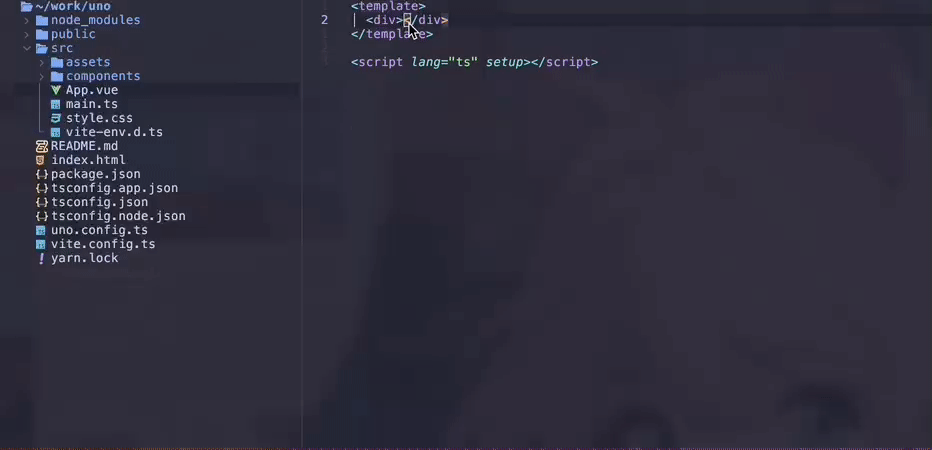

### Unocss lsp and Coc

## preview



## use

coc.nvim

```shell
cocInstall @moliyu/coc-unocss
```

lazyvim
```shell
npm install @moliyu/lsp-unocss -g
```
```lua
{
    "neovim/nvim-lspconfig",
    opts = function(_, opts)
      local util = require("lspconfig.util")
      local configs = require("lspconfig.configs")
      configs.uno = {
        default_config = {
          cmd = { "unocss-lsp", "--stdio" },
          filetypes = {
            "html",
            "javascriptreact",
            "rescript",
            "typescriptreact",
            "vue",
            "svelte",
          },
          root_dir = function(fname)
            return util.root_pattern("unocss.config.js", "unocss.config.ts", "uno.config.js", "uno.config.ts")(fname)
          end,
        },
      }
      require("lspconfig").uno.setup({})
    end
  },
```